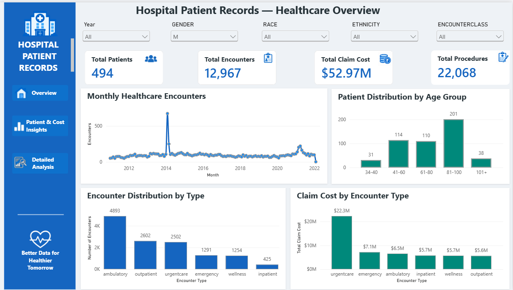
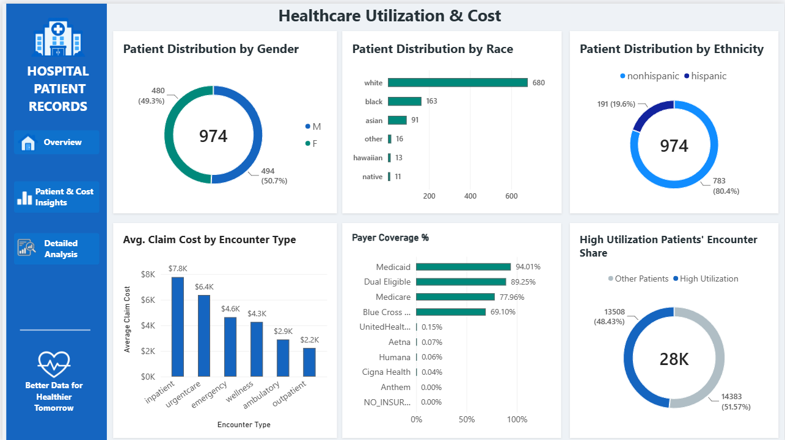
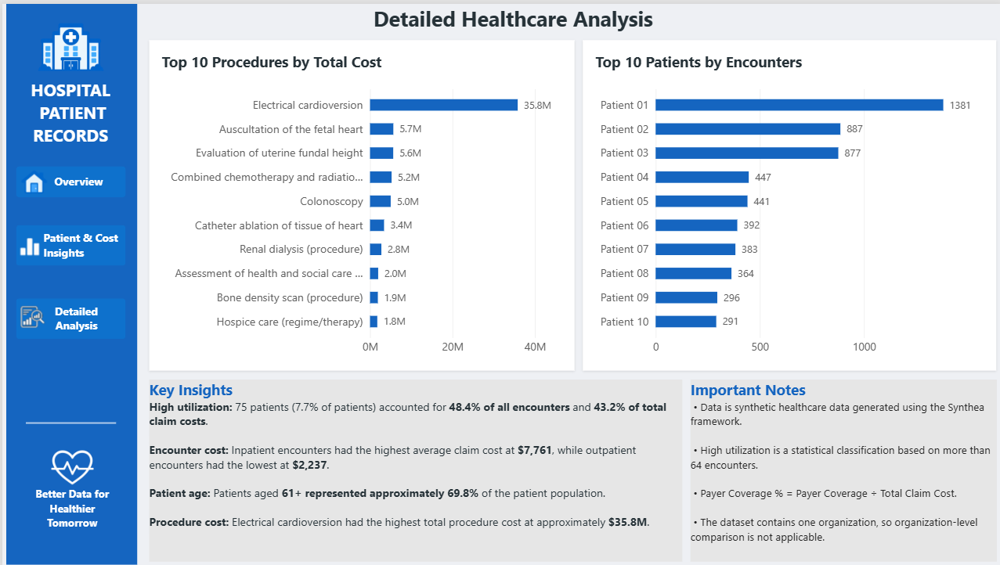

# Hospital Patient Records & Healthcare Analytics

## 📌 Project Overview

This project analyzes synthetic hospital patient records to identify patterns in patient demographics, healthcare utilization, encounter costs, payer coverage, and medical procedures.

The project follows an end-to-end Data Analytics workflow using PostgreSQL, Python, and Power BI.

## 🎯 Objectives

* Analyze patient demographics
* Understand healthcare encounter patterns
* Identify high-utilization patients
* Analyze healthcare costs by encounter type
* Evaluate payer coverage
* Analyze medical procedure frequency and costs
* Build an interactive Power BI dashboard
* Generate data-driven healthcare insights

## 🛠️ Tools & Technologies

* **PostgreSQL** — Database management, SQL queries, joins, aggregations, and analysis
* **Python** — Data cleaning and exploratory data analysis
* **Pandas & NumPy** — Data manipulation and analysis
* **Matplotlib & Seaborn** — Data visualization
* **Power BI** — Interactive dashboard and data visualization
* **GitHub** — Project documentation and portfolio

## 📊 Dataset

The project uses synthetic healthcare data generated using **Synthea** and obtained through Kaggle.

The dataset contains synthetic information related to:

* Patients
* Healthcare encounters
* Medical procedures
* Payers
* Healthcare organizations

> **Note:** The dataset contains synthetic healthcare records and does not represent real patients.

## 🔄 Project Workflow

```text
Raw Healthcare Data
        ↓
Data Understanding & Cleaning
        ↓
PostgreSQL
        ↓
SQL Analysis
        ↓
Python / Pandas EDA
        ↓
Power BI Dashboard
        ↓
Healthcare Insights
```

## 📈 Power BI Dashboard

### 1. Hospital Healthcare Overview

* Total Patients
* Total Encounters
* Total Claim Cost
* Total Procedures
* Monthly Healthcare Encounters
* Patient Distribution by Age Group
* Encounter Distribution by Type
* Claim Cost by Encounter Type

### 2. Healthcare Utilization & Cost

* Patient Distribution by Gender
* Patient Distribution by Race
* Patient Distribution by Ethnicity
* Average Claim Cost by Encounter Type
* Payer Coverage Percentage
* High-Utilization Encounter Share

### 3. Detailed Healthcare Analysis

* Top 10 Procedures by Total Cost
* Top 10 Patients by Number of Encounters
* Key Healthcare Insights
* Important Analytical Notes

## 🔍 Key Insights

* **974 patients** are included in the dataset.
* The dataset contains **27,891 healthcare encounters**.
* Total encounter claim cost is approximately **$101.51 million**.
* The dataset contains **47,701 procedure records**.
* Patients aged **61 and above represent approximately 69.8%** of the patient population.
* **75 patients** were classified as high-utilization patients using a statistical threshold of more than 64 encounters.
* These high-utilization patients accounted for approximately **48.4% of all encounters** and **43.2% of total claim costs**.
* **Inpatient encounters** had the highest average claim cost at approximately **$7,761**.
* **Electrical cardioversion** had the highest total procedure cost at approximately **$35.8 million**.

> High-utilization classification is a statistical classification based on encounter frequency and should not be interpreted as a clinical diagnosis.

## 📁 Project Files

| File                                  | Description                        |
| ------------------------------------- | ---------------------------------- |
| `patients.csv`                        | Raw patient dataset                |
| `encounters.csv`                      | Raw healthcare encounter dataset   |
| `procedures.csv`                      | Raw procedure dataset              |
| `patients_analysis.csv`               | Processed patient analysis         |
| `payer_analysis.csv`                  | Payer-level analysis               |
| `procedure_analysis.csv`              | Procedure-level analysis           |
| `top_patient_encounters.csv`          | Patients ranked by encounter count |
| `high_utilization_analysis.csv`       | High-utilization patient analysis  |
| `Hospital Patient Visualization.pbix` | Power BI dashboard                 |

## 📷 Dashboard Preview

### Hospital Healthcare Overview



### Healthcare Utilization & Cost



### Detailed Healthcare Analysis



## 💡 Skills Demonstrated

* Data Cleaning
* Exploratory Data Analysis
* SQL
* PostgreSQL
* Python
* Pandas
* NumPy
* Data Visualization
* Power BI
* DAX
* Data Modeling
* Healthcare Analytics
* Data Storytelling

## 📌 Disclaimer

This project is intended for educational and portfolio purposes. The healthcare data used in this project is synthetic and does not represent real patients or real clinical records.
